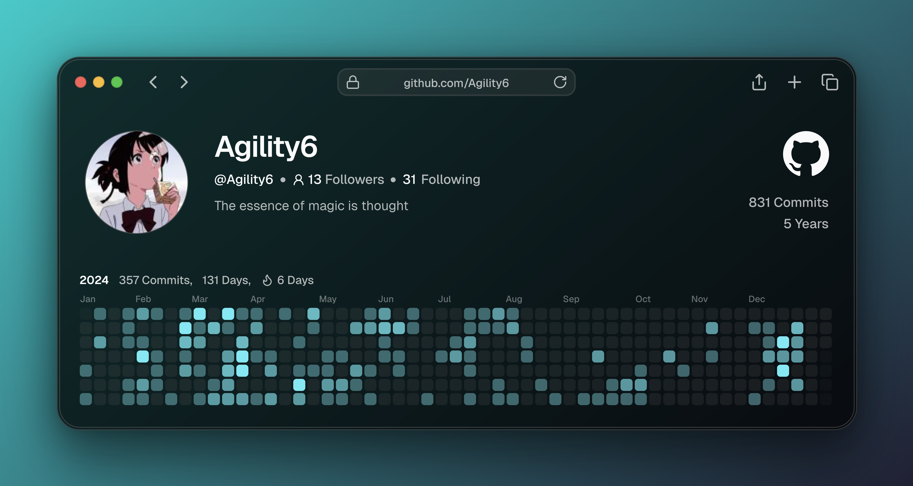
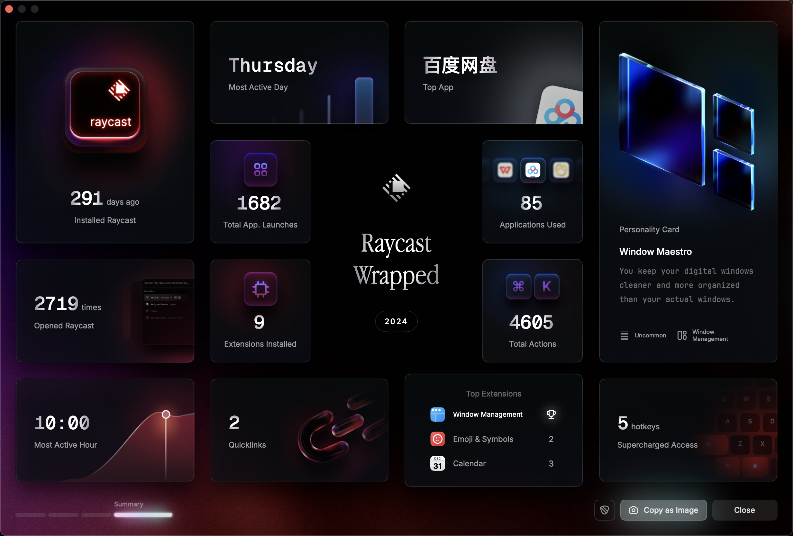

> Ready for 2025 💃

时间来到2024的末尾，年度总结也如约而至这几天不断的回忆；2024年我做了什么，或者说这一年我可以用什么词进行概括呢？最终选择这三个词来概括整一个2024年

1. 校园
2. 实习
3. 选择

---

**在最最最开始的时候先让「科技」告诉我2024年做了什么吧**

(Github!!!)

(Top应用居然是百度网盘，批评居然不是**VsCode/Goland**😢)

(b站大学)

## 抓住校园的尾巴 🎉

这一年虽然名义上我还是一名大学生，但是自我的定位已经是半只脚踏出校园的人了。回想24年春节的时候，给自己下达的目标就是暑假前落实实习。所以在大三下学期的时候，并没有把太多精力花在学校中（~~意思是经常逃课~~）不过还是在大三下的时候参加了一些活动

- 计算机程序设计大赛

- 蓝桥杯算法比赛

虽然结果不太尽人意，计算机程序设计大赛止步于省赛；蓝桥杯省二。现在回想起来其实并不是获奖最开心（奖也很重要‼️）最容易回忆的可能永远都是**过程**

对于计算机程序设计大赛团队赛来说，也是我第一次做出突破

- 第一次以队长的身份参加比赛
- 第一次尝试比赛路演汇报

总之算是突破了自己的舒适圈，尝试了一些新的挑战；十分感谢我的队员们EchoJob（很好听的队名🌱）和指导老师!!!（帮忙找字节的师兄帮我们出谋划策）

---

## 实习 💼

回想23年是我第一次跨出校园参加实习，给我的体验更多是第一次的不习惯和身份的转变，那么24的两段实习相比于23年我又有什么成长呢

1. 心态上，相比于23年我可以更加从容面对实习的工作内容（虽然时常还是感到焦虑）

2. 个人成长上，我更加明确自己是热爱计算机行业

在5月份的时候开始集中投递简历，学历和环境决定了求职的困难度，在开始的时候已经做好了处处碰壁的心态了。

经历「未读」「已读」「已读不回」这三个状态下反复横跳，同时也在不断的自我调整（催眠）下，慢慢地有一些面试的机会，比较幸运的是在6月中旬比较顺利的拿到实习offer，第二段实习的持续到10月份。同月我也迎来了第三段实习，持续进行中～

回看这几段实习经历，很高兴的是我做到了，从一个小公司到中型公司，最后到目前所在的公司一个更加大的平台。

---

## 选择 🤔

最后，我想24年最重要的一个关键词就是「选择」也想谈谈对「选择」的理解

关于选择，很多时候从「当下」时间点来看，会认为这次的选择是正确的；但是从选择后的某个时间段，总会去怀疑自己的选择是否是最最优的。(取决于「当下的状态」)

> 如果选择是自己评估后所决定的，永远不要怀疑它，因为是结合你当下最优的选择\*

每次选择可能都是环环相扣的，在24年面临的最大选择就是，「机会」和「未知」的抉择。

- 选择「挑战」

  在第二段实习中，很意外获得了提前转正的机会，但是结合技术栈和自己的发展方向，我开始犹豫是否要选择这个机会。询问身边的朋友，都给出了接受转正offer；印象很深的是，一张纸一支笔我写下了所有的利与弊选择了放弃。

  在一段时间里我也经常怀疑自己是不是做错了选择，正如上面所说，当发生不符合预期的时候，总是会怀疑自己的选择。

- 选择「不确定」

  10月份加入sl已经两个多月了，大致可以总结一下我的心路历程「开心 -> 害怕 -> 迷茫 -> 不确定 -> 重新规划」，面对「不确定」唯一能做的就是做好准备迎接未知。

---

## 一些 😶

一些比较印象深刻的事情/感悟

- 九月份和初中的朋友见面，突然发现我们讨论的话题已经从无忧无虑到各自的工作、创业以及结婚等话题了。

- 今年也算是尝试了用🍠进行社交，算是一个以前一直不敢尝试的社交方式。

- 实习过程中相识新的好朋友，和优秀（~~抽象😋~~）的人在一起也会不由自主的向前追赶。

- 疑犯追踪，年度美剧!

- 成为一个Gopher!!!（虽然很菜）

- ...

---

## Ready for 2025 💃

24年流水账到这里就结束了，25年也意味着大学即将结束，在充满着未知的挑战下，希望我能够继续坚定的往下走

### 技术方向的思考

希望25年能够朝着以下方向努力

- 计算机基础知识
- 业务「领域」问题解决方案
- 业务「技术」问题解决方案
- 热门中间件的原理

> flag 🚩 2025年决定尝试开启一个repo用于记录!
> 
