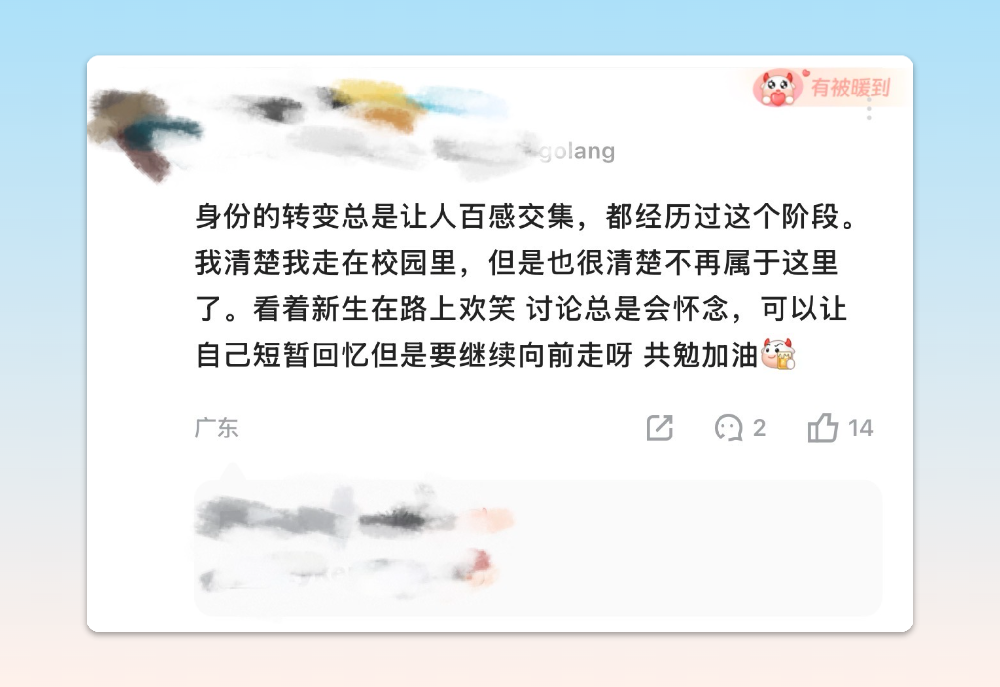
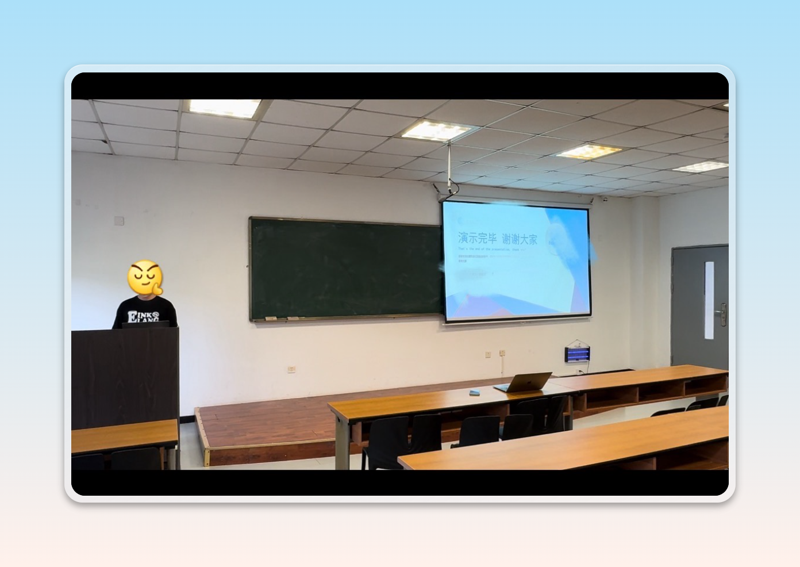
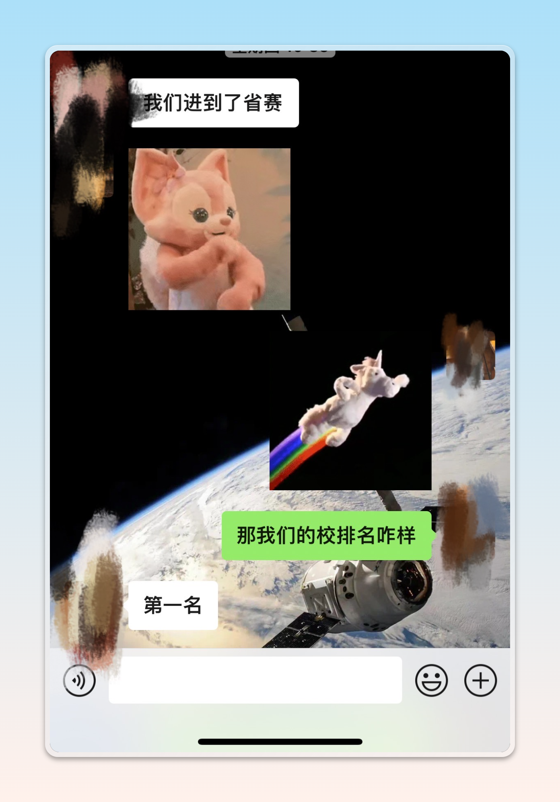
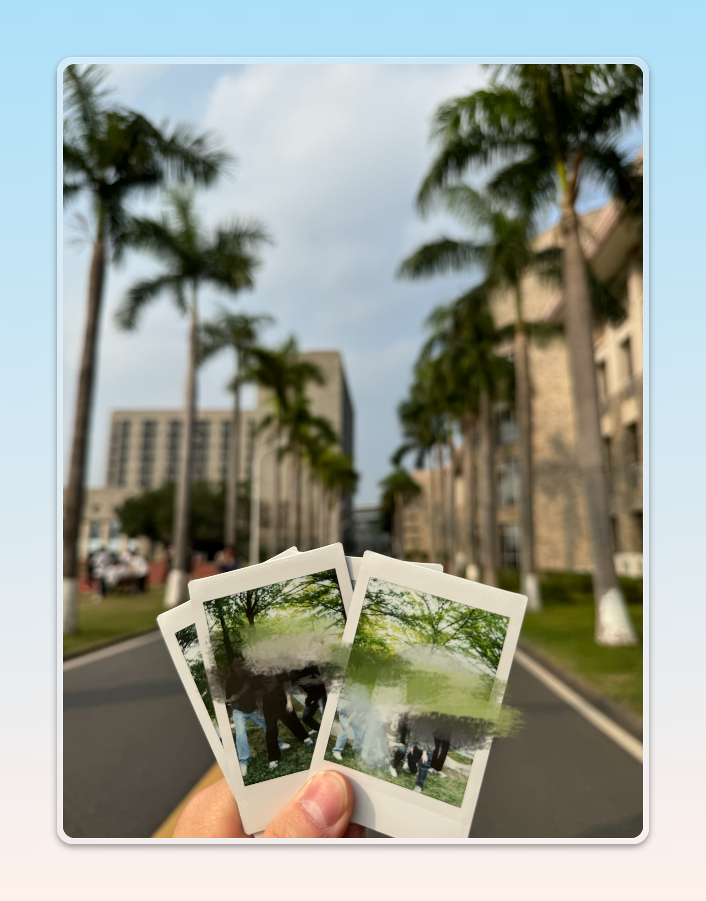
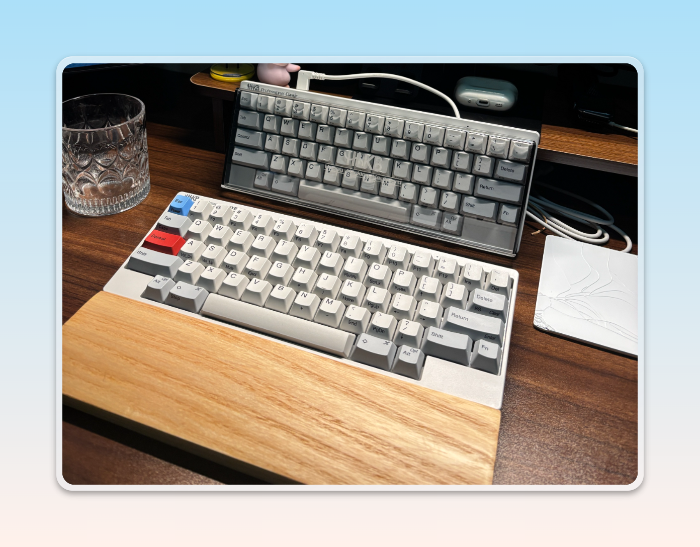
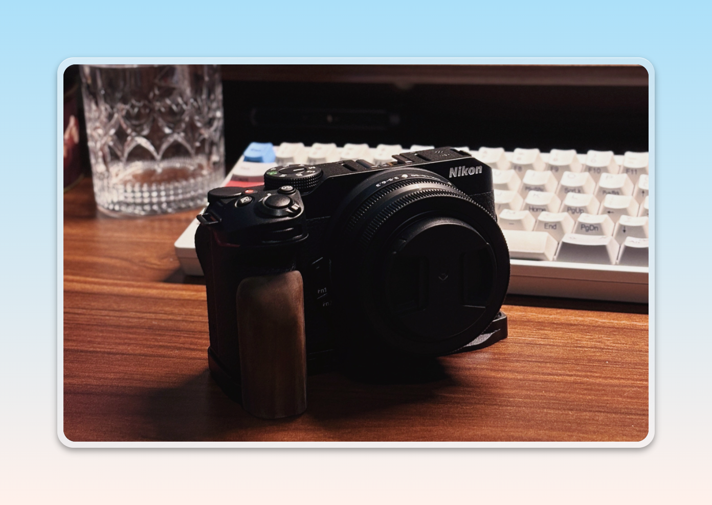
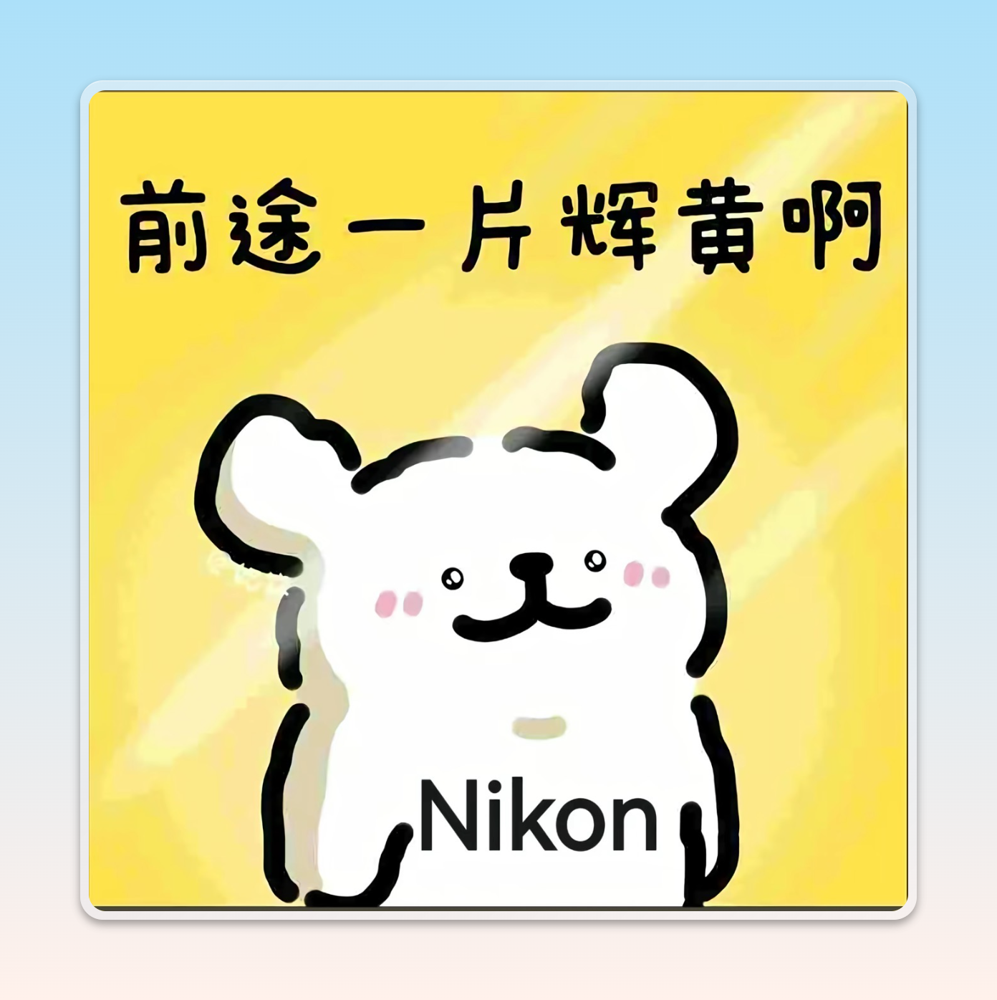

> **纠结过去其实毫无意义，枯萎的枝条就让它枯萎吧。重要的是现在要为自己生命出的新芽而高兴 💭**

2025年已然结束，又到了年底的头脑风暴、疯狂复盘的时候了，靠着照片和零散的手记开始回顾这一整年所发生的事情。

> 2025年的记忆要从三月份的转正开启，而这一年也将围绕工作而展开。

2025年春节过后，得到有转正机会的消息也算是25年比较好的开端，是幸运的，面对如今地狱级工作环境中，能够找到一份自己热爱的、工作环境良好的的确是不容易的。在经历转部门面试一系列流程后，顺利加入目前所有的业务部门中了（很开心🚀

随着正式工作有了着落之后，也来到了校园的最后倒计时了

---

### 真正告别校园 🏫

作为一名钟爱水 「牛客」 的大学生在实习的时候看到一段话（不得不说牛客真的就是，焦虑的源泉。

> 实习完回校有一种割裂感，感觉自己已经不属于校园了，晚上去操场散步看着草坪的人，尸体暖暖的。

一阵强烈的共情感涌入，突然发觉，自己的大学生活一直在追寻实习机会、逃离校园。等真正准备离去的时候，会发现好像在校园中“玩”的不够多、不够尽兴。答辩当天和舍友逛完了校园的每一个角落，每一个必经之路，同时我也知道新的生活已经开启了。

***于是荣获最暖评论，或者是大多数人的感受吧***

#### 如何定义它

回想大学生活，更多是打上“不合群”的标签，可能大多数人都听过这一句话，大学是自由的。

自由的定义是什么，是行为上的自由还是精神上的自由。我倾向于后者，高中的知识是固定的，所有的一切都是成体系的，因此容不了有一丝的偏科。

而大学自由，你可以不用拘泥于专业的限制，书籍就在那里，只要你感兴趣就可以去获取。快速试错、快速了解，可以把 “三分钟热度" 发挥到极致。

这是我对大学的理解。

> **谁也没有权力能支配 一生一趟忠于自己的表演**

#### 一些其他

对于大学的生活、实习、身边的伙伴、老师真的就是无可挑剔的存在了!!!

##### 实习

每一段实习都离不开亲爱的舍友，没有大哥们的掩护就没有光明的未来（bushi

很庆幸大学能够抓住一切机会出去实习，也可能自己始终保持一种快一步、多焦虑一步的观念。

- 第一段坐落于23年的时候，详情可看23年的总结👀 一个稚嫩的大学生第一次外出实习的恐惧（不过环境简直是世外桃源 💯）

- 第二段坐落于24年，这是第一次面临就业的选择，详情可看24年的总结👀 不得不说中秋礼盒是十分气派的。

- 第三段也是如今就职的公司，未完待续...

##### 照片记忆

> **照片和歌曲这两个载体，不仅仅只是感官上的触动，也承载着时光机的作用。**

收获很大的一次比赛，也成功成立了EchoJobs工作室，也第一次尝试当队长。

每次看到这张照片，好像就已经身处在那个自由，比较无忧无虑的环境之中，校园的味道总是独一无二的。

大学超级可爱的老师 + 项目带队老师 + 论文指导老师。

完结毕业!!! 🎓

### 工作 🧑‍💻

> **世界有浮力，放松就能被托举**

实习和工作最大的不同，倒不是压力和工作内容的不同。而是自身的身份转变不同，实习的唯一目的是，能够在秋招/春招脱颖而。

25年最大的变化就是，自我身份的转变这一点在24年或者更早就意识到了，但是真正在其中的时候，焦虑感会具体化。

大学的焦虑或许是一种带有目的性的焦虑，简而言之是为了 「毕业能够有更好的工作」 而焦虑。

如今工作上不得不的面临的是，可能会伴随着无意义、无目的性的焦虑。

25年的后半段也在不停的想这个问题，现在我应该为什么而焦虑呢？或者用 「福格行为模型」 这本书来说现阶段自己的 「动机」 是什么（WIP中...

#### 区分可控 let them 和不可控 let me

今年看到一个比较有趣的观念，需要在生活中区分好这两个类型，进而去获取掌控感。

- 「let them」 随它们去吧，清醒的认识与接受，能控制的只有自己。
- 「let me」 让我来吧，行为的指挥官由我来接纳。

##### 压力来临时

当压力来临时，大脑通常会混在一起处理三件事：

- 发生了什么

- 别人怎么看

- 我现在怎么办

「let them」 先把前两件事卸载掉，事情已经发生了，别人也已经有反应了。记录日志，不再重试，停止无效的心理重算。

「let me」 启动在当前约束条件下，我下一步可控的最小动作是什么？注意这个“最小”。压力大时，**人最容易犯的错是试图一次性解决“整个人生”。**

## 其他

> **一个健康的人，需要学会去“玩”**

- 今年更新了电脑64G!!!

- 大学想要的HHKB键盘!!!

- Nikon Z30!!!

## 最后

- 希望能够保持思考，保持进步，敬畏工程师这个职位，提升硬实力!

- 保持折腾、保持“玩”（Lightroom启动!
