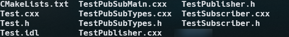
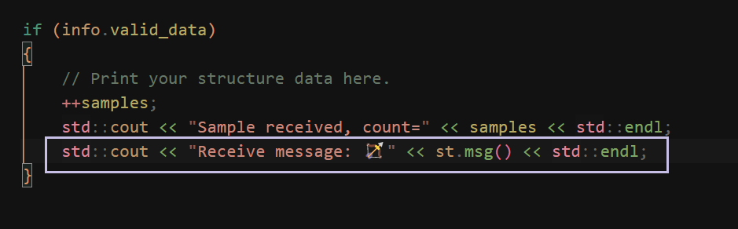
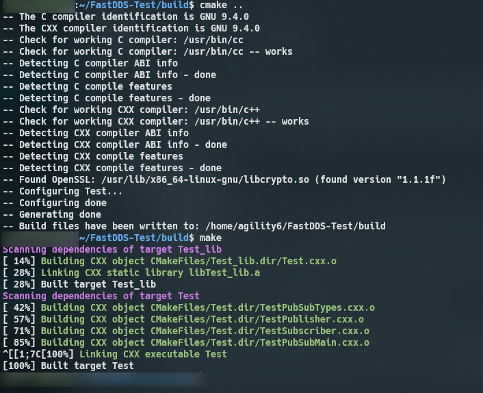

### 前言

本篇文章主要介绍，我在第一次接触FastDDS所遇到的问题。对于一个陌生的知识，我认为应该去初步了解它是做什么的、并且跑通一个最小DEMO。

参考资料
https://cloud.tencent.com/developer/article/1999079
https://fast-dds.docs.eprosima.com/en/latest/

### 初步了解

通过参考资料的介绍，这几个概念是比较关键的

- Publisher:它是负责创建和配置其实现的 DataWriters 的 DCPS 实体。 DataWriter 是负责实际发布消息的实体。每个 DataWriter 都有一个分配的 Topic，在该 Topic 下发布消息。

- Subscriber:它负责接收在其订阅的 Topic下发布的数据。它为一个或多个 DataReader 对象提供服务，这些对象负责将新数据的可用性传达给应用程序。

- Topic(话题):它是绑定发布和订阅的实体。它在 DDS 域中是唯一的。通过TopicDescription，它允许发布和订阅数据类型的统一。

- Domain(领域):这是用于链接所有发布者和订阅者的概念，属于一个或多个应用程序，它们在不同主题下交换数据。这些参与域的单个应用程序称为 DomainParticipant。 DDS 域由域 ID 标识。 DomainParticipant 定义域 ID 以指定它所属的 DDS 域。具有不同 ID 的两个 DomainParticipants 不知道彼此在网络中的存在。因此，可以创建多个通信通道。这适用于涉及多个DDS应用程序的场景，它们各自的 DomainParticipants 相互通信，但这些应用程序不得干扰。 DomainParticipant 充当其他 DCPS 实体的容器，充当发布者、订阅者和主题实体的工厂，并在域中提供管理服务。

对于DEMO的实现，重点关注`Publisher`和`Subscriber`也就是发送和接收这两步

### DEMO实现

- 对于系统的选择，Windows/Mac OC/Linux。如果你是Windows系统，强烈建议你使用WSL，众所周知Windows在环境搭建上十分的劝退。这里我使用WSL

- 安装方式`Colcon installation`、`bin`、`Source`、`docker image`。这里我使用Source安装

```bash
mkdir ~/Fast-DDS
```

1. Foonathan memory

```bash
  cd ~/Fast-DDS
  git clone https://github.com/eProsima/foonathan_memory_vendor.git
  mkdir foonathan_memory_vendor/build
  cd foonathan_memory_vendor/build
  cmake .. -DCMAKE_INSTALL_PREFIX=~/Fast-DDS/install -DBUILD_SHARED_LIBS=ON
  cmake --build . --target install
```

2. Fast CDR

```bash
cd ~/Fast-DDS
git clone https://github.com/eProsima/Fast-CDR.git
mkdir Fast-CDR/build
cd Fast-CDR/build
cmake .. -DCMAKE_INSTALL_PREFIX=~/Fast-DDS/install
cmake --build . --target install
```

3. install eProsima Fast DDS

```bash
cd ~/Fast-DDS
git clone https://github.com/eProsima/Fast-DDS.git
mkdir Fast-DDS/build
cd Fast-DDS/build
cmake ..  -DCMAKE_INSTALL_PREFIX=~/Fast-DDS/install
cmake --build . --target install
```


4. 接下来我们需要使用`Fast DDS Gen`,这个工具是帮助我们实现`idl文件 --> c++代码`
   > 请确保环境中有jdk! Fast DDS-Gen supports Java versions from 11 to 19.

```bash
cd ~
git clone --recursive https://github.com/eProsima/Fast-DDS-Gen.git
cd Fast-DDS-Gen
./gradlew assemble
```

### Create DEMO

```bash
cd ~
mkdir Test && cd Test
```

1. 创建Test.idl

```c++
struct Test {
  string msg;
};
```

2.  `Fast DDS Gen`转化为c++代码。在Test目录下找到Fast-DDS-Gen/scripts/执行fastddsgen -example CMake Text.idl

```bash
../Fast-DDS-Gen/scripts/fastddsgen -example CMake Text.idl
```



3. 添加分别在`TestPublisher.cxx`和`TestSubscriber.cxx`。分别代表了要输出什么 和 怎么输出

- TestPublisher.cxx
  

- TestSubscriber.cxx
  

4. 构建

```bash
mkdir build && cd build
cmake ..
make
```

- 如果你在`cmake..`的时候遇到了以下报错。需要安装fastrtps

  ```text
     By not providing "Findfastrtps.cmake" in CMAKE_MODULE_PATH this project has
     asked CMake to find a package configuration file provided by "fastrtps",
     but CMake did not find one.

     Could not find a package configuration file provided by "fastrtps" with any
     of the following names:

     fastrtpsConfig.cmake
     fastrtps-config.cmake

     Add the installation prefix of "fastrtps" to CMAKE_PREFIX_PATH or set
     "fastrtps_DIR" to a directory containing one of the above files.  If
     "fastrtps" provides a separate development package or SDK, be sure it has
     been installed.
  ```

  - 安装`Fast-RTPS`

  ```bash
  cd ~
  git clone https://github.com/eProsima/Fast-RTPS
  mkdir Fast-RTPS/build && cd Fast-RTPS/build

  cmake -DTHIRDPARTY=ON ..
  make
  sudo make install
  ```

  - 如果再次执行后如果发现缺少`foonathan_memory`则需要安装

  ```bash
  cd ~
  cd Fast-RTPS/thirdparty
  git clone https://github.com/foonathan/memory.git
  cd memory
  mkdir build && cd build
  cmake ..
  make
  sudo make install
  ```

  - 再次执行
    

5. 执行`publisher | subscriber`

```bash
~/FastDDS-Test/build$ ./Test publisher
```

```bash
~/FastDDS-Test/build$ ./Test subscriber
```

- 如果你在执行`publisher | subscriber`碰到了以下错误

  ```text
  ./Test: error while loading shared libraries: libfoonathan_memory-0.7.3.so: cannot open shared object file: No such file or directory
  ```

  - 路径问题，通过`sudo find / -name libfoonathan_memory-0.7.3.so`找到路线进行添加

  ```bash
  export LD_LIBRARY_PATH="YOUR_PATH"
  ```

  - 更新动态库缓存

  ```bash
  sudo ldconfig
  ```

### DEMO


