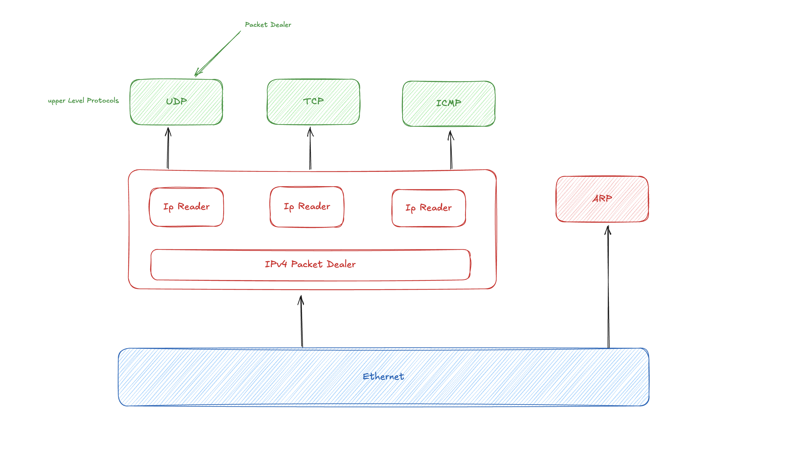

- https://arxiv.org/abs/1603.05636

### Network Stack in Go with CSP Style

该论文尝试使用Golang和 CSP 风格对内核网络栈进行实现

- Golang具有垃圾回收机制 & 强类型特性

- CSP (Communicating Sequential Processes) 利用 goroutine 和 channel 并行机制，把复杂任务拆分多个并发子任务

GoNet通过虚拟的tab网络接口在**用户态模拟**一个独立的网络栈，协议栈主要分为三层，数据链路层、网络层和传输层

主要通过 packet dealer 设计，每一层主要的 goroutine 负责接收来自下层的数据包，通过 channel 进行分发给多个 goroutine 处理

