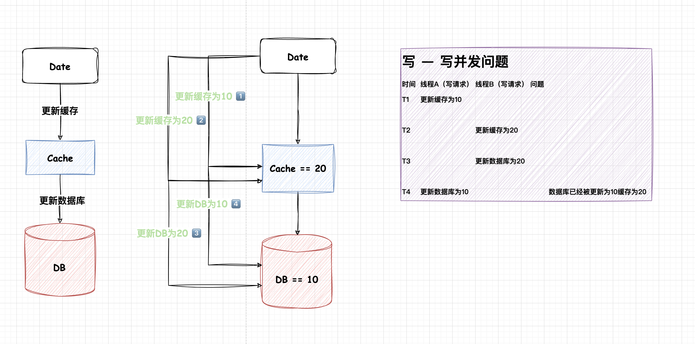
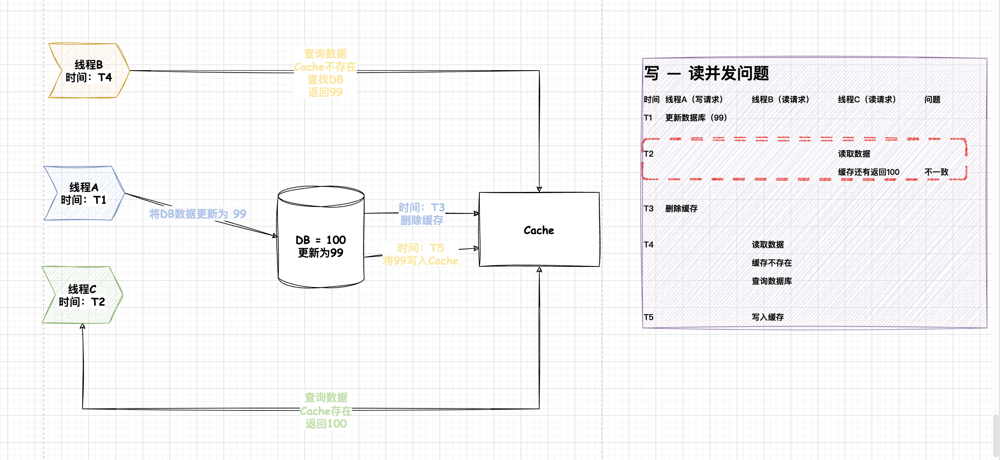

## 前言

MySQL和Redis，这两个都是在项目中常用的工具，MySQL作为数据的持久化保证，虽然说在MySQL默认的存储引擎InnoDB中比较好的平衡了「高性能和高可靠」，但是如果想应对互联网的大型流量上，可能还是捉襟见肘甚至可能导致整个系统崩溃。

公认的项目中通常是「读多写少」的情况，换言之可能在大部分时候数据不是那么多变的。因此缓存的引入可以解决**读多**情况。

## Redis是什么

这里不长篇的介绍Redis的各个细节，我们先来讨论一下缓存是什么？缓存其实本质来说就是「空间换时间」的概念，在常见的系统设计时候，无一例外都会使用到缓存这个思想，例如解析URL的DNS服务器存在缓存、InnoDB中的Buffer Pool也是缓存的一种思想。

回到Redis来说，Redis单实例的读QPS可以达到10w/s，其实足以因对大部分场景了。

## 使用缓存的思想

在此之前我先简单的谈一谈，我对新技术引入的一些思考。

1. 在我看来，每一个新组件的引入可能会带来性能上的提升，同时也会带来一定的开发成本，而这一个成本就是需要对项目进行评估是非有必要。

2. 确定引入新组件，那么可以从该组件本身使用上可能会出现的问题、与原来的技术结合可能会出现的问题

假如项目中引入了Redis来做缓存，那么数据一致性问题一定是逃离不开的，这个就是属于**新组件与原来技术结合**会出现的问题。

前面我们说到，Redis本质上是以空间换时间的思想，那么意味着数据是存在与多个空间中。简单的来说就是，只要Redis的数据没有及时的更新而导致新数据没有同步到MySQL中，那么就出现了数据不一致。

**使用了缓存一定会出现不一致的情况，我们能做的只是将这个时间窗口尽可能小**。因为MySQL和Redis不在一个事务中，无法保证两个同时成功或同时失败，**如果使用分布式事务等各种手段去保证强一致，那么回头看引入缓存的目的就不谋合了**。

说到这里就可以得出结论正对数据不一致的情况，主要把关注点放在「缩短不一致的时间窗口」 + 「确保数据的最终一致性」

## 几种更新缓存策略

先来看看通常在使用缓存的伪代码吧

1. 优先查询缓存，查询不到才查询数据库
2. 缓存没数据库有，更新缓存

```java
data = getDataCache(key);
if (data == null) {
    data = getDataDB(key)
    if (data != null) {
        updateDataCache(key, data)
    }
}
```

查询的逻辑比较简单，一致性的问题通常不会出现在查询中，而是**写请求中**。针对查询可以去了解缓存常见的三大问题。

针对写请求主要可以总结为4个策略

1. 更新数据库后更新缓存
2. 更新缓存后更新数据库
3. 删除缓存后更新数据库
4. 删除缓存前更新数据库

### 更新数据库后更新缓存 —— 数据不一致问题

图很容易可以看到，这种情况在**写-写**的时候会出现数据不一致的情况。如果后续没有进行数据对齐，那么这个不一致只能等到系阿姨次数据库更新或者缓存失效才可能修复。


### 更新缓存后更新数据库

要注意，数据库的作用是持久化数据的，如果使用这个方法，那么可能导致**错误数据**，而不是**脏数据**。例如在更新的时候，更新缓存成功，但是更新数据库失败。那么这个问题就严重了。下一次查询的时候获取缓存中的数据，但是这个数据根本不在数据库中。还是用一张图来看看在并发的时候**写-写**可能出现什么问题吧。



### 删除缓存后更新数据库

如果是使用删除策略呢？首先来看看有什么好处吧，在**并发的写-写**请求中，这样的策略是不会出现什么问题，无论是什么顺序，缓存最后都会被删除，那么就不会存在说数据不一致的情况了。

那么来看看在**读-写**并发的时候会不会有什么问题吧。

1. 线程A更新（**写**）这个数据的同时，线程B读取（**读**）这个数据
2. 线程A成功删除了缓存里的老数据，这时候线程B查询数据发现缓存失效
3. 线程A更新数据库成功

> 如果读请求写Cache的时机是在，写请求后面。那么就会出现数据不一致的情况

### 删除缓存前更新数据库

再来考虑一下，**读—写**并发的情况

从图中可以很清楚的看到，先更细数据库再删除缓存，只有**在更新数据库成功到缓存删除之间**有时间差，可能会被其他线程读取到旧数据


> 引申：考虑一下这一种情况，会不会在一开始的时候，读请求就发现缓存不存在了呢？

个人认为不太可能出现这种情况，**注意⚠️：我们考虑的是并发的情况下**，如果说在此条件下出现了一开始缓存就不存在的话，那么可能就是**写场景很多**

### 总结

✌️我们已经讨论了所有的情况

1. 在使用**更新缓存+更新数据库**的策略时，可能会出现DB失败，导致数据不一致。解决办法，利用**MQ**确认数据库更新成功（**代码复杂**）

2. 在使用**删除缓存+更新数据库**的策略时，在并发**写+读**的情况，可能会出现不一致的情况，利用**延迟双删**来解决

   > 延时双删：需要评估延迟的时间，如果控制不好那么也是没有作用的。
   > 所谓的延迟双删就是，防止**读请求把旧数据写回DB**，那么在写请求处理完之后，等到差不多的时间延迟再重新删除这个缓存值
   > 延迟的时间：太长那么该时间窗口得到的数据都是脏数据，太短相当于无用功了

从出现的概率来说，比较推荐使用**更新数据库后删除缓存值**，不知道你记不记得该策略还可能有什么问题？上面我们讨论过一个问题就是，会不会一开始就缓存不存在呢？
这种情况相当于**写操作比较多**。会有什么问题呢？导致的主要问题就是，key会频繁的失效，打到数据库中，如果这个key还是一个热点key😱

所以总结一下，大致可以分为以下情况

- **业务如果是读多写少：使用更新数据库后删除缓存**
- **针对写多读少或者是读写相当多：使用更新数据库后更新缓存**

## 最终一致性

> 最终一致性才是王道！

### 缓存设置过期时间

### 减少缓存删除/更新的失败

如果因为服务的情况没有正常执行Cache的步骤，那么可能造成长时间的不一致

可以使用消息中间件来保证删除或者更新的成功


### 通过订阅MySQL binLog的方式来处理缓存

Canal这个开源项目可以很好的帮助我们


