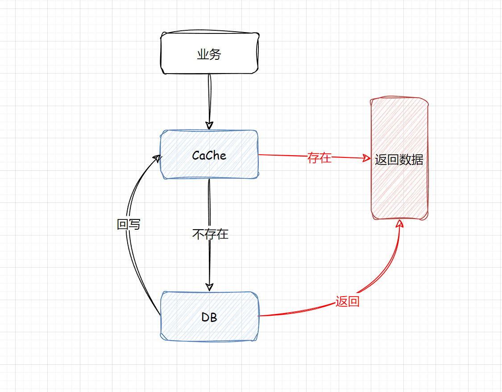
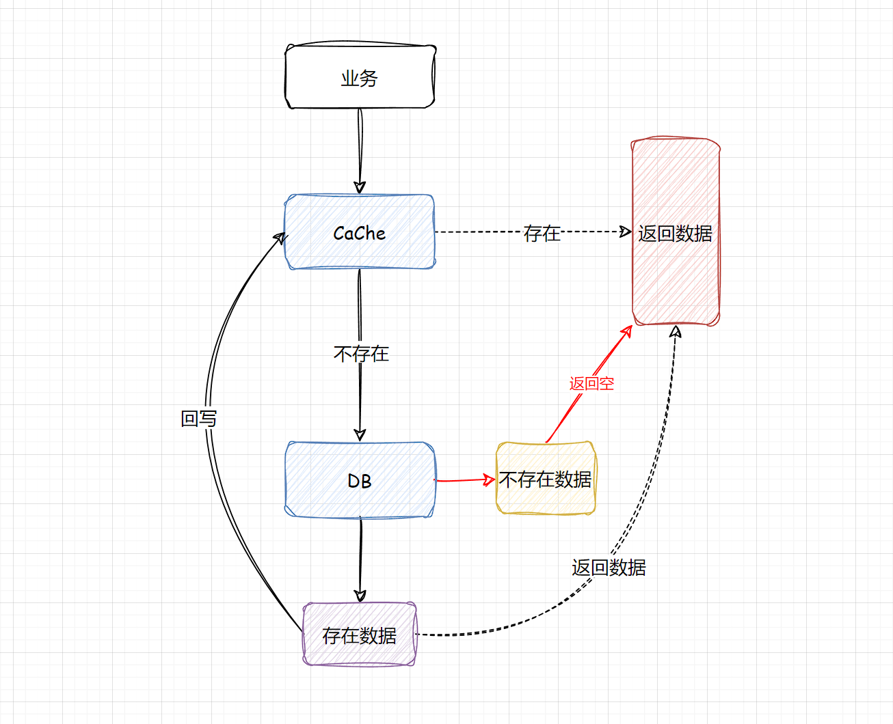
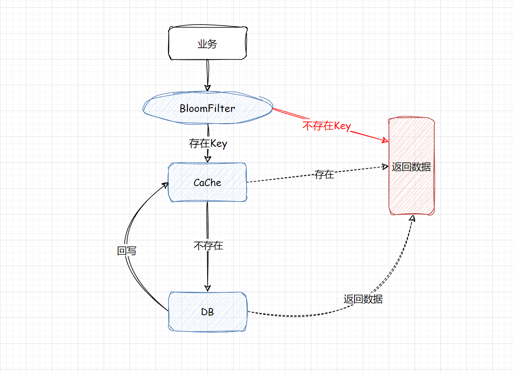
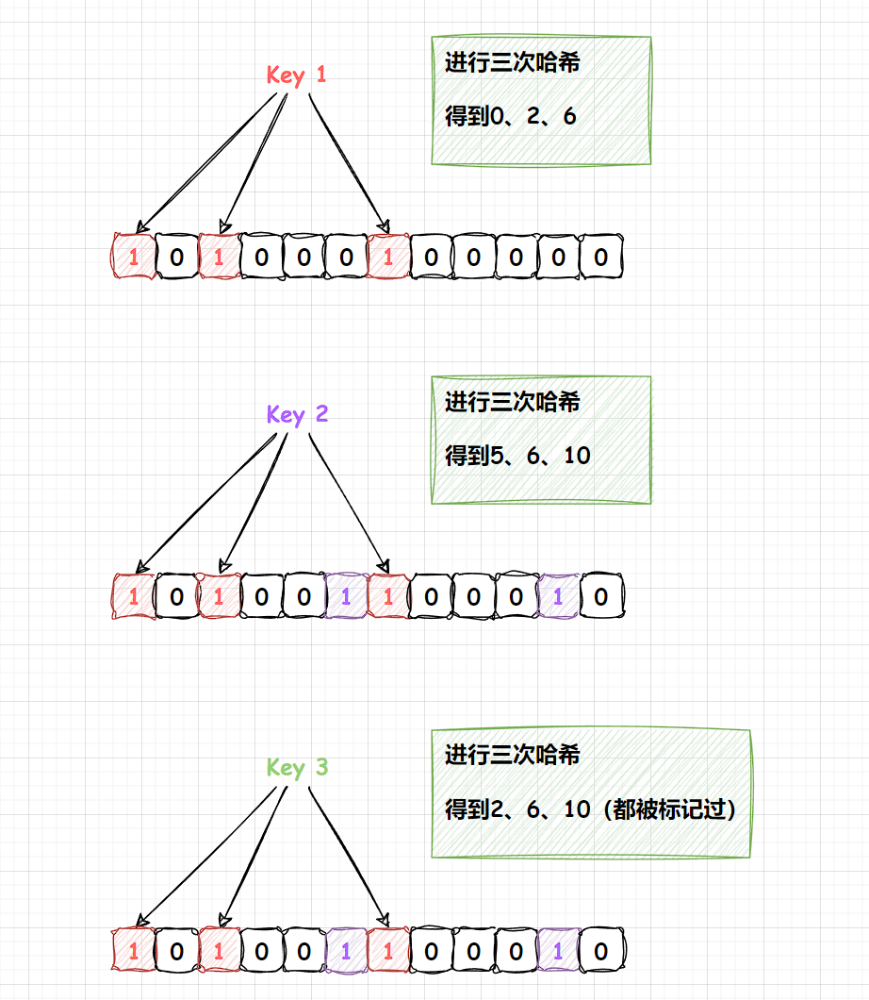
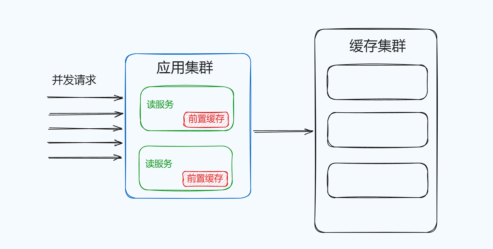

## 缓存的经典问题

1. 缓存失效
2. 缓存穿透
3. 缓存雪崩
4. 数据不一致
5. 数据并发竞争
6. Hot Key
7. Big Key

> 每一个问题都参照四个步骤进行阐述：问题描述、原因分析、业务场景、解决方案

### 缓存失效

#### 问题描述

当一个系统中存在大量的热点数据，通常情况下就需要上缓存，大致的流程就是

1. 查缓存（有则直接返回）
2. 查DB（缓存中不存在）
3. 将查到的数据回写到缓存中



我们希望数据查询尽可能命中，这样系统负载最小，性能最佳，但是如果这时候有**大量的Key同时失效**，很多缓存数据访问都会miss，就会穿透到DB中，这样就会导致整体的系统压力急剧上升，这就是缓存失效的问题。

#### 原因分析

导致缓存失效的主要原因，就是批量Key一起失效，简言之就是在加入缓存时过期时间都是一致的。一般情况下，缓存时逐步写入的，所以自然就会是逐步淘汰的。

但是，在一些场景下，如果需要将一个批次的热点数据添加到缓存中，这时候如果过期时间没有做处理，就会造成批量的Key同时失效。

#### 业务场景

比如说一批次的火车票、飞机票当票售卖的时候，系统会一次性加载到缓存中。

#### 解决方案

前面分析了，缓存失效最主要的原因就是大量的Key同时失效，那么解决方案也是从这一个方面出发。

设计缓存的过期时间，**过期时间 = base时间 + 随机时间**。这样数据在以后是慢慢过期，而不是瞬间全部过期。

> base时间如何设计？
>
> 1. 应用程序的性质
> 2. 缓存数据的更新频率
> 3. 缓存数据的大小和内存容量

### 缓存穿透

#### 问题描述

“穿透”顾名思义就是穿过Cache和DB，简单来说，当我们查询个别的Key时，缓存中没有命中，自然就会查DB，DB也不存在这个数据，那么这时候就无法回写到缓存中，这样就会导致**查询缓存中不存在的数据时，每次都要查询数据库**。



> 在量级不大的流量，缓存穿透发生概率很低，并且缓存穿透很难被发现！

#### 原因分析

根本原因很简单，就是访问了不存在的Key和数据。

在系统设计的时候，更多是考虑正常访问的路径，对特殊访问路径、异常访问路径考虑相对欠缺。

#### 业务分析

缓存穿透的业务场景很多，比如通过不存在ID访问商品等。

其实在个例的缓存穿透，对系统几乎没有影响，但如果是大量的缓存穿透攻击，在短时间大批量的查询不存在，有可能导致DB直接宕机。

#### 解决方案

1. 当在查询这些不存在的数据，第一次查DB，虽然没有查到结果返回NULL，但是依旧去记录这一个Key，只是这个Key对应的value是一个特殊的值。


2. 构建一个BloomFilter缓存过滤器，记录**全量数据**，这样访问数据时，可以直接通过BloomFilter判断这个Key是否存在，如果不存在直接返回即可，根本无需查缓存和DB。



**方案一的一些问题**：当遇到高密度批量的访问不存在的Key，即便是Key只设置一个简单的默认值，也会占用大量的资源。

**改善的策略：**

1. 针对这些不存在的Key设置较短的过期时间，尽快过期。
2. 将这些不存在的Key存入到一个公共缓存中，首先查找业务缓存，如果miss则查找公共缓存中的非法Key，如果公共缓存命中则直接返回，如果公共缓存不存在，则会到达DB，DB如果也是为miss，则将Key回写到公共缓存中，如果DB存在正常回写即可。


#### 布隆过滤器

布隆过滤器是一种基于**位数组**和**多个哈希函数**，布隆过滤器用于判断一个元素是否存在于一个集合中，布隆过滤器也是存在一定的误判率。

**工作原理**

布隆过滤器是一种概率型数据结构，可以高效的插入和查询，得到某个值是否存在。采用一个很长的二进制数组，通过一系列的Hash函数来确定该数据是否存在。本质上是一个n位的二进制数组，每个元素只有0和1来表示。

可以从下图得出：**布隆过滤器对于“未出现”的判断是准确的，但无法对出现过做出绝对的正确判断**。



**如何减少布隆过滤器的误判？**

- 第一个是增加二进制位数，增加位数组的长度。
- 第二个是增加Hash的次数，其实每一次Hash处理都是在增加数据的特征，特征 越多，出现误判的概率就越小。

```java
@Autowired
private RedissonClient redissonClient;

private RBloomFilter<Object> bloomFilter;

@PostConstruct
public void init() {

    bloomFilter = redissonClient.getBloomFilter("bloom-filter");
    // 初始化，设置数组长度和误判率
    bloomFilter.tryInit(1000000L, 0.01);
    // 将所有的key添加到bloomFilter中即可

}
```

上面的代码中，通过Redisson创建了一个BloomFilter对象，设置了位数组长度位1000000，误判率位1%，然后通过`add()`方法向布隆过滤器中添加元素，通过`contains()`方法判断元素是否存在于布隆过滤器中。

另外，**布隆过滤器不支持元素删除操作，一旦删除元素，可能会影响元素的判断结果**

**衍生问题：在初始化后，对应商品被删除怎么办？**

假如布隆过滤器初始化后，对应商品被删除了，该怎么办？

因为布隆过滤器某一位的二进制数据，可能被多个编号的Hash位进行引用，所以不能直接对布隆过滤器某一位进行删除，否则数据就会乱了。

**常见的解决方案**

1. 定时异步重建布隆过滤器，比如说每过4个小时在额外的一台服务器上，异步去执行一个任务调度，来重新生成布隆过滤器，替换掉已有的布隆过滤器。
2. 计数布隆过滤器，在标准的布隆过滤器下，是无法得知当前某一位它是被哪些具体数据进行引用，但是计数布隆过滤器它是在这一位上额外的附加的计数信息，表达出该位被几个数据进行引用。

### 缓存雪崩

#### 问题描述

系统运行过程中，缓存雪崩是一个非常严 重的问题，缓存雪崩是指部分缓存节点不可用，导致整个缓存体系甚至服务系统不可用的情况。

缓存雪崩安装缓存是否支持rehash分两种情况

1. 缓存不支持rehash导致的系统雪崩不可用。
2. 缓存支持rehash导致的缓存雪崩不可用。

#### 原因分析

在上述两种情况，缓存不进行rehash时产生的雪崩，**一般是由于较多缓存节点不可用**，请求穿透导致DB也过载不可用，最终整个系统雪崩。而缓存支持rehash时产生的雪崩，则大多数跟流量洪峰有关，流量洪峰到达，引发部分缓存节点过载Crash，然后因rehash扩散到其他缓存节点，最终整个缓存体系异常。

第一种情况，缓存节点不支持rehash，较多缓存节点不可用时，大量Cache访问失败，这些请求会进一步访问DB，而且DB可承载的访问量远比缓存小的多，请求量过大，就很容易造成DB过载，大量慢查询，最终阻塞甚至宕机，从而导致服务异常

第二种情况，因为缓存分布式设计时，会选择一致性hash分布式方法，同时在部分节点异常时，采用rehash策略，即把异常节点请求平均分散到其他缓存节点，在一般情况下，一致性hash分布 + rehash策略可以很好的运行，但**在大量的流量洪峰到来时**，如果大流量key比较集中，正好在某1~2个缓存节点，很容易将这些缓存节点的内存节点异常宕机，然后异常下线，这些大流量Key请求有被rehash到其他缓存节点，进而导致其他缓存节点也被过载Crash，缓存异常持续扩散，最终导致整个缓存体系异常。

#### 业务场景

#### 解决方案

预防雪崩

1. 对业务DB的访问增加读写开关，当发现DB请求变慢、阻塞、慢查询超过阈值，关闭读开关，部分或者所有读DB的请求继续快速失败、立即返回，等DB恢复之后再打开读开关。
2. 对缓存增加多个副本，缓存异常或请求miss后，在读取其他缓存副本。
3. 缓存监控

### 数据不一致

#### 问题描述

1. 同一份数据，有可能发生，DB和缓存的不一致。
2. 如果缓存有多个副本，多个缓存副本里面的数据也可能会发生不一致现象。

#### 原因分析

**DB和缓存的不一致**

大多数是和**缓存更新异常**或者是**更新的策略**有关。

**缓存多个副本不一致**

系统采用一致性Hash分布，同时采用rehash自动漂移策略，在节点多次上下线之后，也会产生脏数据。缓存有多个副本时，更新某个副本失败，也会导致这个副本的数据是老数据。

#### 业务场景

#### 解决方案

##### DB和缓存的不一致解决方案

在通常情况下，最直观的方法就是，在更新DB的数据完成的时候再更新缓存，或者相反，这个方法也称为（**双更新策略**）。

```java
public void putValue(key, value) {
    putToRedis(key, vlaue);
    putToDB(key, value); // 操作失败
}
```

**后删除策略（能解决多数不一致情况）**

因为每一次读取时，都先会判断Redis中是否有值，没有则会读取DB，这样是没有问题的，但是需要考虑的问题是

- 先删缓存？
- 后删缓存？

**先删缓存**

```java
public void putValue(key, value) {
    deleteFromRedis(key);
    putToDB(key, value); // 操作失败
}
```

如果线程A删除了某个Key的值，这时候有另一个请求B到来，那么它就会穿到DB中，读取到旧的值。无论操作A更新数据库的操作持续多长时间，都会产生不一致的情况。

**后删缓存**

把删除的动作放在后面，就能够保证每次读取到的值都是最新的

```java
public void putValue(key, value) {
    putToDB(key, value);
    deleteFromRedis(key);
}
```

这是我们日常中常用的模式，Spring cache就是默认实现了这个模式，分别介绍一下读和写的过程。

**数据的读取过程，规则是“先读Cache，再读DB”**

1. 每次读取数据，都从Cache读。
2. 如果读到了，则直接返回。
3. 如果读不到Cache的数据，则从DB中读。
4. 读取到的数据回写到Cache中。

**写请求，规则是“先更新DB，再删除Cache”**

1. 将变更写入到数据库中。
2. 删除缓存中的对应数据。

**衍生问题：但是我们如果考虑高并发的情况下，这种方案其实也是有问题的**

常见的问题就是，在变更数据库的时候是成功的，但是因为类似网络的问题导致删除缓存是失败的。

**延迟双删**

要能够确保删除动作一定被执行，那就可以解决问题，起码能够缩小数据不一致的时间窗口，常用的方式就是延迟双删，依然是先更新再删除，唯一不同的就是把删除的动作，在不久后再执行一次，比如说3秒后。

```java
public void putValue(key, value) {
    putToDB(key, value);
    deleteFromRedis(key);

    ...deleteFromRedis(key, after3sec);
}
```

这一种方案需要具体情况具体分析，例如如果第一次删除缓存已经是抛异常了，那么就算延迟几秒钟删除，它依旧是会抛异常的。删除动作是有多种选择的。

1. 放在DelayQueue中，会有随着JVM进程的死亡，丢失更新的风险
2. 放在MQ中，可能会增加架构的复杂度

**闪电缓存**

将缓存失效的时间设置非常短，这样也可以避免数据不一致的情况

> 根据业务来决定！

##### 缓存多个副本不一致

不采用rehash漂移策略，而采用缓存分层策略，尽量避免脏数据。

缓存系统中包含热点数据、常规数据、冷数据，缓存空间划分为三个层级：第一层存储热点数据，第二层存储常用数据，第三次存储相对冷的数据。每个层级都可以设置不同的缓存容量和缓存时间。

### 数据并发竞争

#### 问题描述

数据并发竞争，是指在高并发访问场景，一旦缓存访问没有找到数据，大量请求就会并发查询DB，导致DB压力大增的现象。

主要是由于多个进程/线程中，有大量并发请求获取相同的数据，而这个数据Key因为正好过期、被剔除等各种原因在缓存中不存在，这些进程/线程之间没有任何协调，然后一起去并发查询DB，请求那个相同的Key，最终导致DB压力大增

**关键词：批量请求同一个Key，Key不存在**

#### 业务场景

- 车票系统，如果某个火车车次缓存信息过期，但仍然有大量用户在查询该车次信息
- 微博正好被缓存淘汰，但这条微博仍然有大量的转发、评论、赞。

上述情况存在并发竞争读取的问题。

#### 解决方案

**方案一：使用全局锁**

当缓存请求miss后，先尝试加全局锁，只有加全局锁成功的线程，才可以到DB去加载数据。其他进程/线程在读取缓存数据miss时，如果发现这个Key有全局锁，就进行等待，待之前的线程将DB的数据回写到缓存的后，再从缓存中获取。


```java
RLock lock = redissonClient.getLock("global_lock"); // 获取全局锁

if (cacheMiss) {
    boolean locked = false;
    try {
        locked = lock.try.tryLock(10, TimeUnit.SECONDS); // 尝试获取全局锁，等待10秒钟
       	if (locked) {
            // 获取到全局锁后，从数据库加载数据，并存储到缓存中
            loadDataFromDatabase();
            storeDataToCache();
        } else {
            // 获取全局锁失败，等待一段时间重试
            Thread.sleep(1000);
            loadDataFromCache();
        }
    } catch (InterruptedException e) {
        // 异常处理
    } final {
        if (locked) {
            // 释放
            lock.unlock();
        }
    }
} else {
    // 如果缓存可获得，直接返回
    loadDataFromCache();
}
```

### Hot Key

#### 问题描述

#### 原因分析

Hot key引发缓存系统异常，主要是系统接受到突然热门的事件，超大量的请求访问热点事件对应的Key，大量的请求访问请求同一个Key，流量集中打在了一个缓存节点机器。

并发请求非常大，访问数据完全相同的请求称为热点查询。

#### 业务场景

突发的事件都有可能造成Hot key的情况，秒杀、双11等。

#### 解决方案

##### 前置缓存

本地缓存，部署在应用服务中的本地缓存

热点查询是对相同的数据进行不断重复查询的一种场景。**特点是次数多，但需要存储的数据少，因为数据是相同**。针对这类业务场景，可以将热点数据前置缓存在应用程序内来应对热点查询。



**应用内缓存需要设置上限**

前置缓存对应的宿主机内存是有限的，还要支持业务应用使用，必须设置缓存容量的上线且设置容量满了逐出策略，LRU，将最少用的缓存在容量满的时候清理掉。

前置缓存需要设置过期时间。

**其次是根据业务对待延迟的问题**

前置缓存的延迟问题的解决方案要么采用定期（被动）刷新，要么采用主动刷新。

如果要实现感知变化，可以采用Binlog的方式，在变更时主动刷新，需要注意的是前置缓存的主动感知不设置在前置缓存所在的应用中，因为业务代码在该机器运行，通过MQ感知会消费CPU和内存资源，前置缓存的数据量小，很多变更的消息因为不是热点数据而被忽略掉，为了前置缓存的更新，可以将前置缓存的内容异构出来一份用作判断。（**复杂**）


##### 主动发现

找出热点Key，首先可以将这些热点Key进行分散处理，例如将一个热点Key中，分散为`hotKey#1`、`hotKey#2`、`hotKey#3`将这些key分散存在多个缓存节点中，然后客户端请求时，随机访问其中某个后缀的hotkey，这样就可以把热key请求打散。

借助外部计数工具来实现热点的发现，可以在一个集中的位置对于请求的数据进行比较，根据配置的阈值判断请求是否会命中数据，是否触发热点Key，对于判断为热点的数据，主动推送到前置缓存中。


##### 降级兜底

对于超出预期的流量，使用限流策略，限流的阈值设置为压测的40%-50%

### Big Key

#### 问题描述

大Key，是指在缓存访问时，部分Key的Value过大、读写、加载易超时的现象。

#### 原因分析

如果这些大Key占总数据的比例很小，导致很容易被频繁剔除，DB反复加载。如果业务中这些大Key很多，而这种Key被大量访问，也会导致较大的Key慢查询。

另外，如果大Key缓存的字段较多，每个字段的变更都会引发这个缓存数据的变更，同时这些Key也会被频繁地读取，读写相互影响，也会导致慢查询现象，大Key一旦被缓存淘汰，DB加载可能需要花费很多时间，这也会导致大Key查询慢的问题。

#### 业务场景

例如保存用户最新1万个粉丝的业务，一个用户个人信息缓存，包括基本资料等。

#### 解决方案

##### 将大Key分拆为多个key，尽量减少大Key的存在

由于大Key一旦穿透到DB，加载耗时很大，所以可以对这些大Key进行特殊照顾，**设置较长的过期时间**，缓存内部淘汰Key时，同等条件下，尽量不淘汰这些大Key。

避免大Key的产生，采取以下策略

1. 分解大Key：可以将大Key拆分成多个小Key，每个小Key对应的Value数据不超过Redis的内存限制，将一个包含大量数据的哈希类型，拆分成多个小的哈希类型。每个小的哈希类型只包含一部分数据。
2. 压缩Value数据：可以对的Key的Value数据进行压缩，降低存储空间，从而减少Redis的内存占用，例如，使用gzip等压缩算法对Value数据进行压缩。
3. 限制数据量：可以设定一个阈值，当一个Key的Value数据超过一定的大小时，自动拒绝写入或进行切分，例如，设置Redis的maxmemory参数、限制Redis内存使用量

> 删除Big Key
>
> 当我们侦察出大Key之后，删除大Key，**切勿使用`DEL`命令**，它的复杂度是O(n)，n是元素的数量。因为Redis是单线程的所以这样就会阻塞线程了。
>
> 使用Redis的`UNLIK`命令 ，后台开启线程删除。
